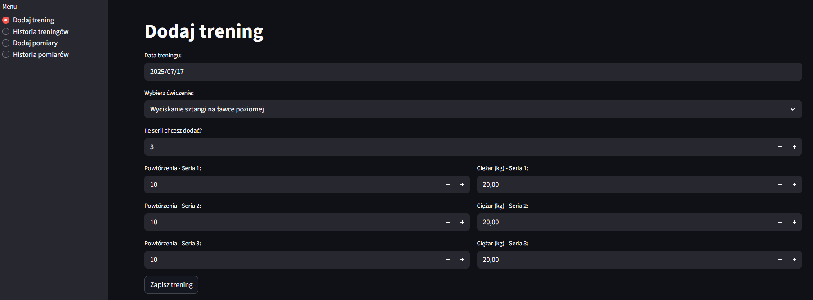
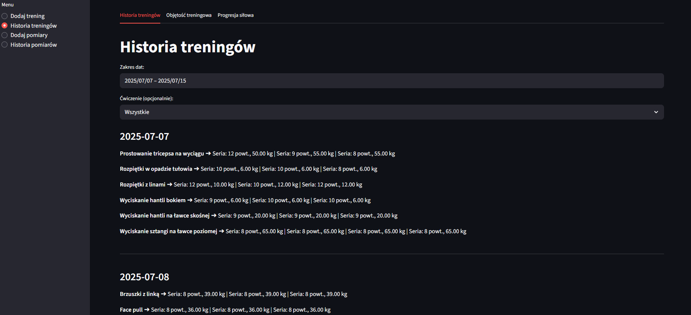

# Analizator Progresu na Siłowni
Aplikacja okienkowa do śledzenia i analizy postępów na siłowni, stworzona w Pythonie z użyciem Streamlit, MSSQL, Pandas i Plotly.

## Technologie
    - Python 3.x
    - Streamlit
    - MS SQL Server
    - pyodbc
    - pandas
    - plotly
    - datetime

## Wymagania
    - Python 3.x
    - MS SQL Server
    - Biblioteki:
        pip install streamlit pyodbc pandas plotly

## Uruchomienie aplikacji
streamlit run main.py

## Aktualnie zaimplementowane funkcjonalności:
1. Baza ćwiczeń
    - Lista ćwiczeń z podstawowymi i szczegółowymi partiami mięśniowymi.
2. Dodawanie treningu
    - Wybór ćwiczeń, rejestrowanie serii (powtórzenia, ciężar).
    - Automatyczny zapis do bazy danych MSSQL.
3. Wyświetlenie historii treningów
    - lista ćwiczeń wraz z liczbą serii, powtórzeń i ciężarem

## Planowane rozbudowy:
- Podsumowania tygodniowe/miesięczne (ilość serii na partie ciała).
- Analiza progresu konkretnego ćwiczenia na wykresach (ciężar, powtórzenia, objętość).
- Formularz pomiarów ciała (obwody, waga, skład ciała) z analizą zmian.
- Tworzenie i zapisywanie planów treningowych (Push/Pull/Legs, Full Body itd.).
- Eksport danych do CSV lub PDF.
- filtrowanie histori treningu po dacie

## Zrzuty ekrenu
### Formularz dodawnia treningu

### Historia treningu
