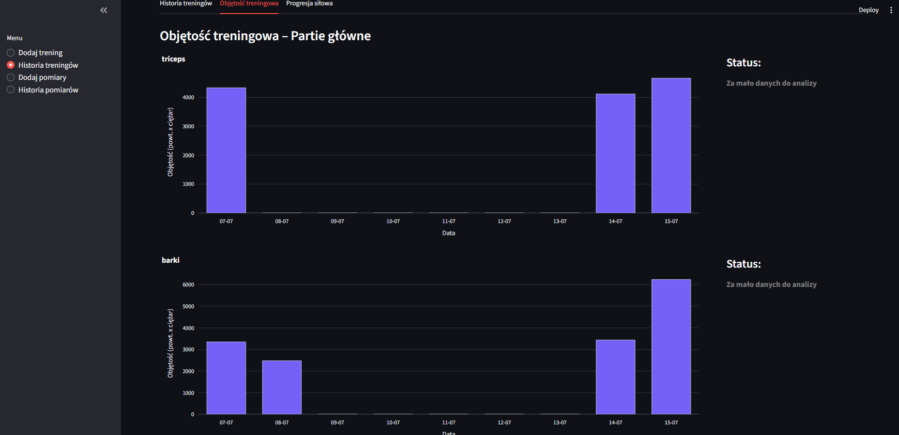

# Analizator Progresu na Siłowni
Aplikacja webowa do monitorowania postępów treningowych i analizy objętości siłowej. Pozwala na rejestrację treningów, śledzenie pomiarów ciała oraz graficzne przedstawienie danych wraz z analizą przetrenowania/niedotrenowania.

Zbudowana w oparciu o Python + Streamlit + MS SQL Server + Pandas + Plotly.

## Technologie
    * Python 3.x
    * Streamlit
    * MS SQL Server
    * pyodbc
    * pandas
    * plotly
    * datetime

## Wymagania
    * Python 3.x
    * MS SQL Server
    * Biblioteki:
        pip install streamlit pyodbc pandas plotly

## Uruchomienie aplikacji
streamlit run main.py

## Aktualnie zaimplementowane funkcjonalności:
1. Baza ćwiczeń
    * Lista ćwiczeń skategoryzowana według:
        - partii głównych (np. plecy, nogi)
        - partii szczegółowych (np. biceps, czworogłowe)
    * Każde ćwiczenie powiązane z grupami mięśniowymi

2. Dodawanie treningu
    * Wybór ćwiczeń
    * Dane automatycznie zapisywane do MSSQL
    * Obsługa wielu serii i ćwiczeń w jednej sesji

3. Historia treningów
    * Filtrowanie po zakresie dat i ćwiczeniach
    * Szczegóły wykonanych serii: powtórzenia, ciężar
    * Automatyczne wyliczanie objętości siłowej (powtórzenia × ciężar) dla partii głównych.
    * Wykres słupkowy objętości dziennej dla każdej grupy mięśniowej.
    * Tygodniowa analiza trendu objętości:
        - Przetrenowanie: wzrost >30% vs poprzednie tygodnie
        - Niedotrenowanie: spadek >20%
        - Status "objętość stabilna" lub "brak danych"

4. Pomiary ciała
    * Formularz zapisu pomiarów (ramiona, pas, klatka itp.).
    * Dane zapisywane do MSSQL.

5. Historia pomiarów
    * Przegląd pomiarów w czasie na wykresach.
    * Możliwość wyboru konkretnej partii ciała.
    * Wizualizacja zmian sylwetki.

## Planowane rozbudowy:
    * Progresja siłowa:
        - Śledzenie zmian ciężaru/powtórzeń dla danego ćwiczenia.
        - Wykresy liniowe i analiza trendów.
    * Tygodniowe/miesięczne raporty (objętość, częstotliwość, liczba serii).
    * Dodawanie planów treningowych
    
## Zrzuty ekrenu
### Formularz dodawnia treningu

### Historia treningu

### Formularz pomiaru ciała

### Historia treningu
