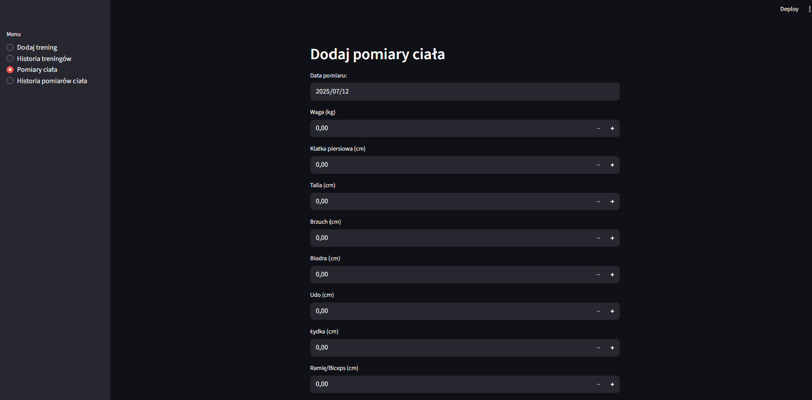
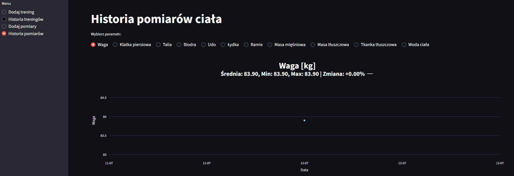

# Analizator Progresu na Siłowni
Aplikacja okienkowa do śledzenia i analizy postępów treningowych. Umożliwia rejestrowanie treningów siłowych, zapisywanie pomiarów ciała oraz przeglądanie historii w przejrzysty sposób.

Zbudowana z użyciem **Python + Streamlit + MSSQL + Pandas + Plotly**.

## Technologie
    - Python 3.x
    - [Streamlit](https://streamlit.io)
    - MS SQL Server
    - pyodbc
    - pandas
    - plotly
    - datetime

## Wymagania
    - Python 3.x
    - MS SQL Server
    - Biblioteki:
        pip install streamlit pyodbc pandas plotly

## Uruchomienie aplikacji
streamlit run main.py

## Aktualnie zaimplementowane funkcjonalności:
1. Baza ćwiczeń
    - Lista ćwiczeń z podstawowymi i szczegółowymi partiami mięśniowymi.
2. Dodawanie treningu
    - Wybór ćwiczeń, 
    - Rejestrowanie serii (ilość powtórzeń, ciężar).
    - Automatyczny zapis do bazy danych MSSQL.
3. Historia treningów
    - Przegląd zapisanych treningów z możliwością filtrowania po dacie i ćwiczeniu
    - Szczegóły każdego ćwiczenia (ilość powtórzeń, ciężar)
4. Pomiary ciała
    - Formularz do wprowadzania pomiarów ciała (np. obwód ramienia, klatki, pasa)
5. Historia pomiarów
    - Przegląd pomiarów w czasie
    - Możliwość wyboru konkretnej partii ciała

## Planowane rozbudowy:
- Tygodniowe/miesięczne podsumowania (objętość treningowa, liczba serii na grupy mięśniowe)
- Analiza progresu konkretnego ćwiczenia na wykresach (ciężar, powtórzenia, objętość).
- Tworzenie i zapisywanie planów treningowych (Push/Pull/Legs, Full Body itd.).
- Eksport danych do CSV lub PDF.

## Zrzuty ekrenu
### Formularz dodawnia treningu

### Historia treningu

### Formularz pomiaru ciała

### Historia treningu
