# Gym Progress Dashboard

A personal strength training & body composition analytics dashboard built with **Streamlit**.   Designed for lifters who want data-driven insights, not just workout logs.

The app tracks training volume, intensity, exercise progress, fatigue, and body metrics — with a strong focus on long-term trends, recomposition quality, and proportions.

---

## Architecture

### Layered Design

The application follows a **clean architecture** with clear separation of concerns:

```
┌─────────────────────────────────────────┐
│         UI Layer (ui/*.py)              │  ← Presentation only
│    DashboardView, ExerciseView, etc     │
└──────────────┬──────────────────────────┘
               │ uses pre-computed
               ↓
┌─────────────────────────────────────────┐
│       Metrics Layer (metrics/*.py)      │  ← Business logic
│   Computes all KPIs and analytics      │
└──────────────┬──────────────────────────┘
               │ consumes
               ↓
┌─────────────────────────────────────────┐
│      Data Layer (data_*.py, db/)        │  ← Persistence
│    Database queries & transformations   │
└─────────────────────────────────────────┘
```

### Directory Structure

- **`ui/`** — Streamlit presentation layer
  - View classes that render pre-computed metrics
  - No business logic (no calculations, filtering, or data manipulation)
  - Communicates via styled components to the metrics layer
  - Utilities for formatting and helpers (`ui_helpers.py`)

- **`metrics/`** — Business logic & analytics engine
  - Pure functions that compute KPIs from raw data
  - Each domain has dedicated metrics modules:
    - `session_metrics.py` — Training volume, intensity, consistency
    - `exercise_metrics.py` — Per-exercise progress and volume distribution
    - `progress_metrics.py` — Strength progress, plateaus, regressions
    - `fatigue_metrics.py` — Fatigue and recovery monitoring
    - `body_metrics.py` — Body composition, measurements, proportions, insights
  - All calculations are **stateless** and **testable**

- **`data_loader.py`** — Data orchestration
  - Loads all data from database
  - Transforms database records into MetricsInput domain objects
  - Handles caching

- **`data_manager.py`** — Database abstraction
  - Wraps SQL queries and database operations
  - Returns Pandas DataFrames for convenience

- **`db/`** — Database layer
  - Connection management
  - Raw SQL queries and mutations

---

## Features

### Training & Progress
- Workout session overview (volume, intensity, duration)
- Exercise-level strength progress
- Per-body-part training distribution
- Estimated 1RM trends
- Consistency & exposure-based progress tracking

### Advanced Analytics
- Fatigue & recovery monitoring
- Progress vs exposure insights
- Plateau and regression detection
- Training balance across body parts

### Body Metrics
- Body composition tracking (weight, muscle mass, fat mass, water mass)
- Body measurements tracking (waist, chest, hips, thighs, arms, calves)
- Trend-based analysis instead of single measurements
- Proportion ratios (e.g. chest/waist, thigh/waist)
- Recomposition quality insights (lean mass vs total weight change)

### UX & Design
- Dark UI
- KPI-first layout (current / average / best)
- Dropdown-based metric selection to avoid chart overload
- Clean visual hierarchy

---

## Development Principles

### Views Don't Calculate
- Views are **presentation-only**
- All metrics are pre-computed by the metrics layer
- Views receive structured data and render it
- This keeps views testable and simple

### Metrics Are Pure
- Metrics functions are pure functions with no side effects
- All calculations happen in the metrics layer
- Easy to test independently without Streamlit context

### Type Safety
- All functions have type hints
- MetricsInput is a structured dataclass
- Views receive strongly-typed metric dictionaries

---

## Screenshots

### Main Dashboard
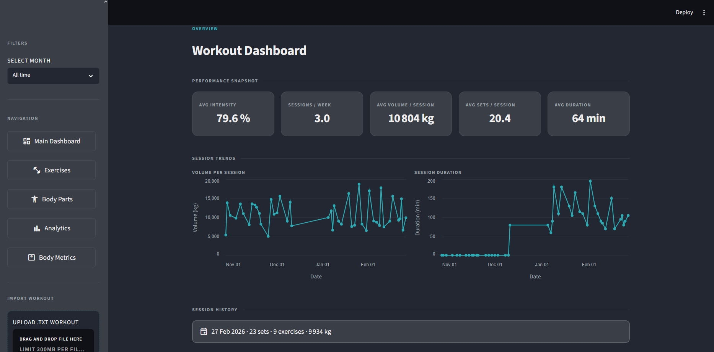
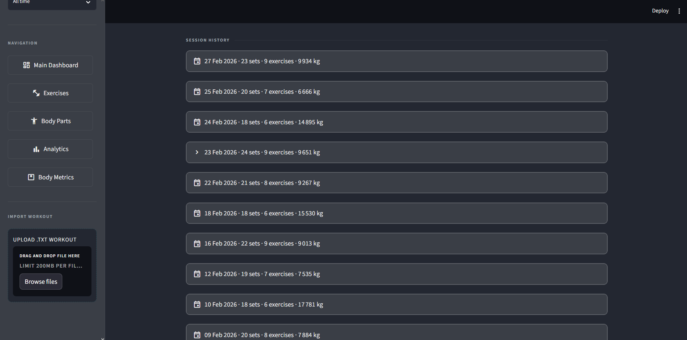
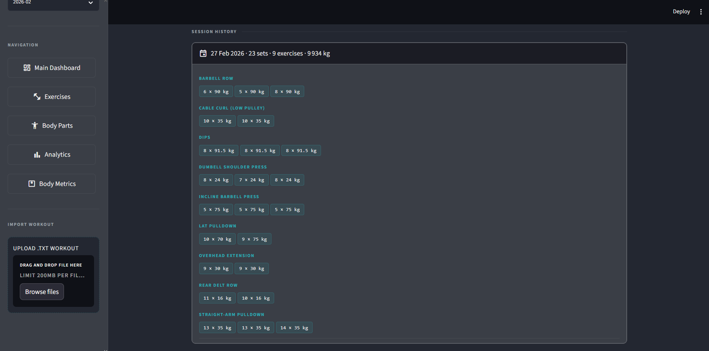

### Exercises
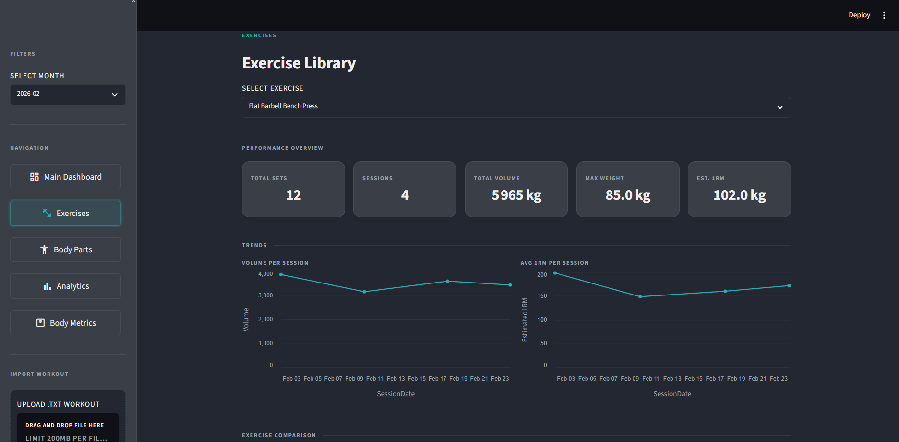
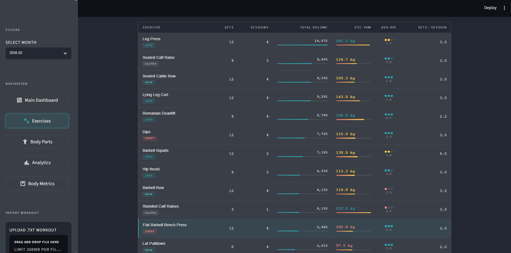

### Body Parts
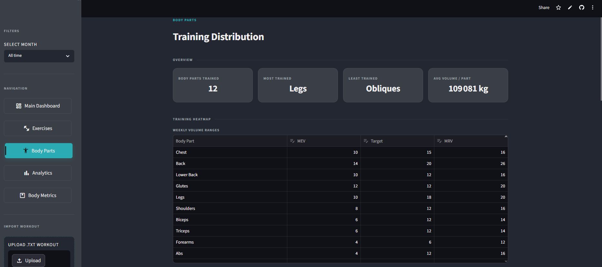
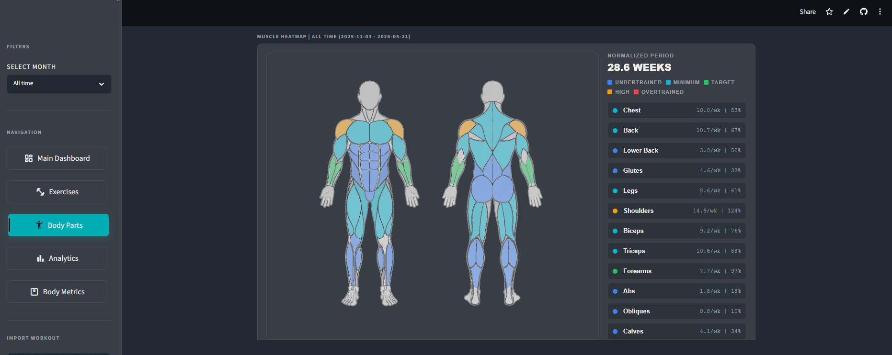

### Analytics View
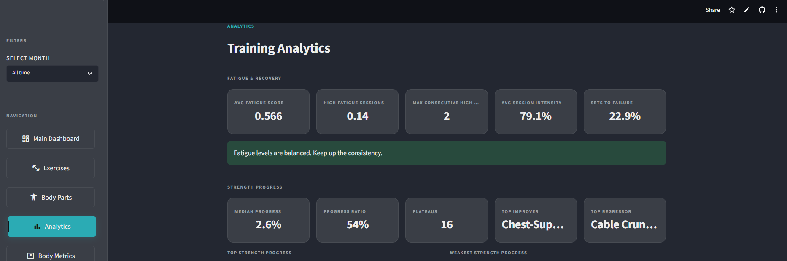
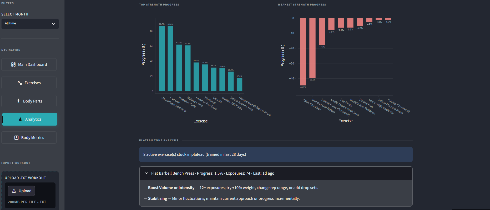
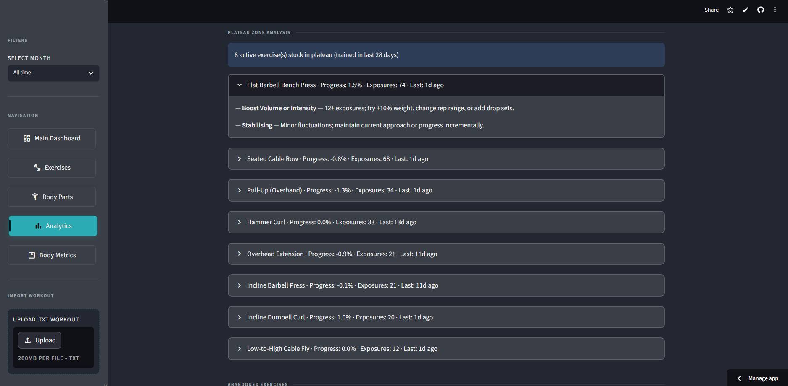

### Body Metrics View
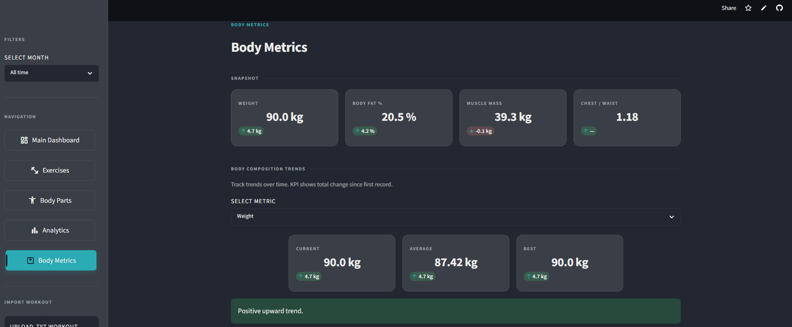
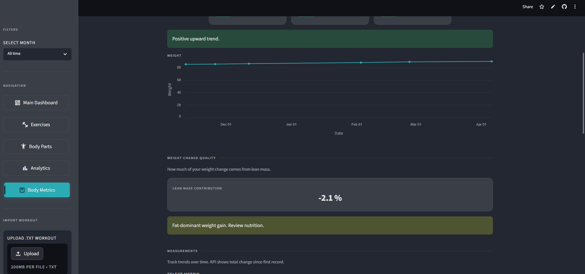
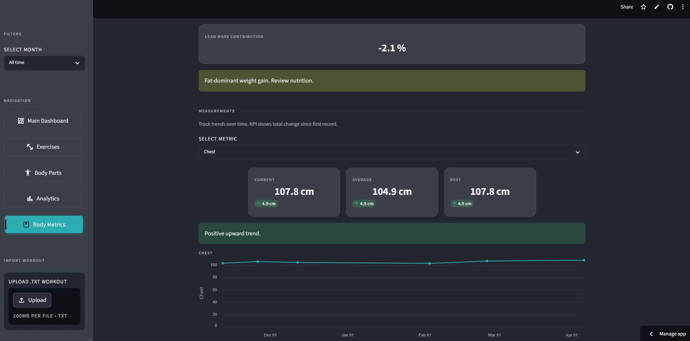
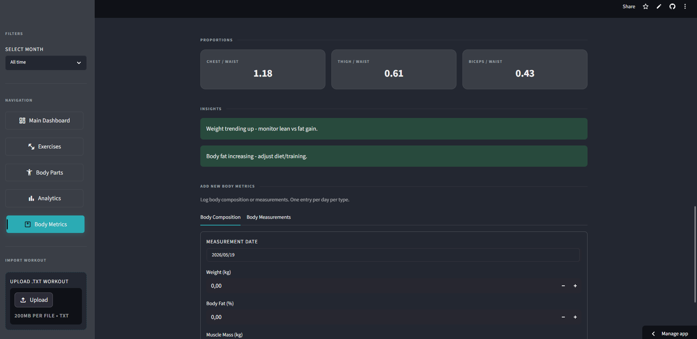
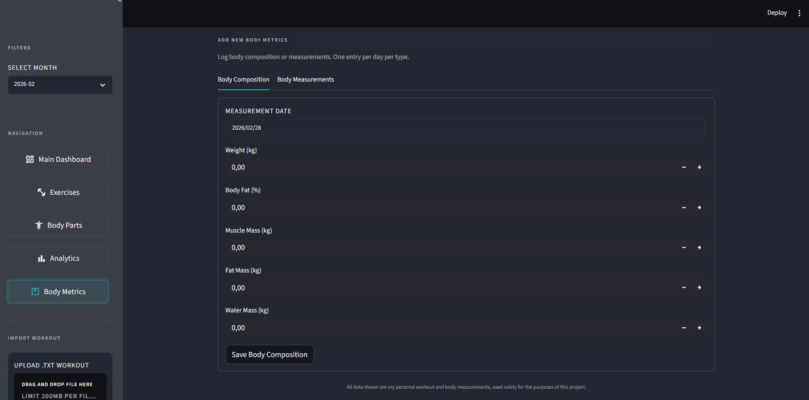

---

## Application Sections

### Main Dashboard
High-level training overview:
- Avg intensity
- Sessions per week
- Volume & duration trends
- Session history

### Exercises
- Strength progress per exercise
- Volume and exposure tracking
- Exercise-specific trends

### Body Parts
- Volume distribution per body part
- Avg estimated 1RM per body part
- Training balance overview

### Analytics
- Fatigue & recovery analysis
- Strength progress quality
- Plateaus vs improving lifts
- Basic insights

### Body Metrics
- Body composition trends
- Body measurements trends
- Proportion analysis
- Recomposition quality
- Manual measurement input

---

## Tech Stack

- **Python** — Language
- **Streamlit** — UI & app framework
- **Pandas** — data processing
- **Plotly** — interactive charts
- **SQLAlchemy** — database access
- **SQL (MS SQL / SQLite)** — persistent storage

---

## Data Model

### Training
- `WorkoutSessions`
- `WorkoutExercises`
- `WorkoutSets`
- `Exercises`

### Body Tracking
- `BodyComposition`  
  *(weight, muscle mass, fat mass, water mass, body fat %)*
- `BodyMeasurements`  
  *(waist, chest, abdomen, hips, thighs, arms, calves)*

---

## How to Run

### Clone repository
```bash
git clone https://github.com/BaseMar/ProgressAnalyzer.git
cd gym-progress-dashboard
